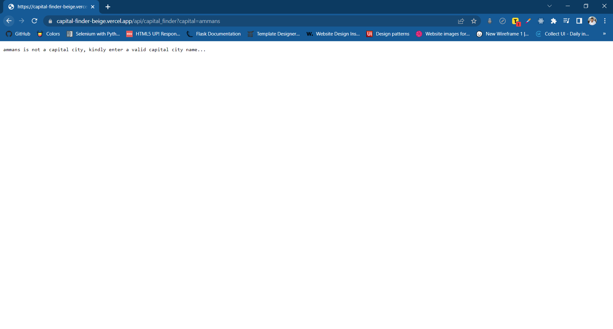

# LAB - Class 13

## Project: Serverless Functions

## Author(s): Yazan Alfarra

## Project Description

Capital finder is an implementation of the serverless using vercel along with dealing with api, based on query attachements, results appear to the user.

## How to initialize/run the application

### Home route

[https://capital-finder-beige.vercel.app/api/capital-finder](https://capital-finder-beige.vercel.app/api/capital-finder)

### Response Output

---

### Get the capital city of a country

[https://capital-finder-beige.vercel.app/api/capital-finder?country=jordan](https://capital-finder-beige.vercel.app/api/capital-finder?country=jordan)

### Response Output

### Get the capital city of a country | wrong entry

[https://capital-finder-beige.vercel.app/api/capital-finder?country=jordans](https://capital-finder-beige.vercel.app/api/capital-finder?country=jordans)

### Response Output

---

### Get country from capital city

[https://capital-finder-beige.vercel.app/api/capital-finder?capital=amman](https://capital-finder-beige.vercel.app/api/capital-finder?capital=amman)

### Response Output

### Get country from capital city | wrong entry

[https://capital-finder-beige.vercel.app/api/capital-finder?capital=ammans](https://capital-finder-beige.vercel.app/api/capital-finder?capital=ammans)

### Response Output

